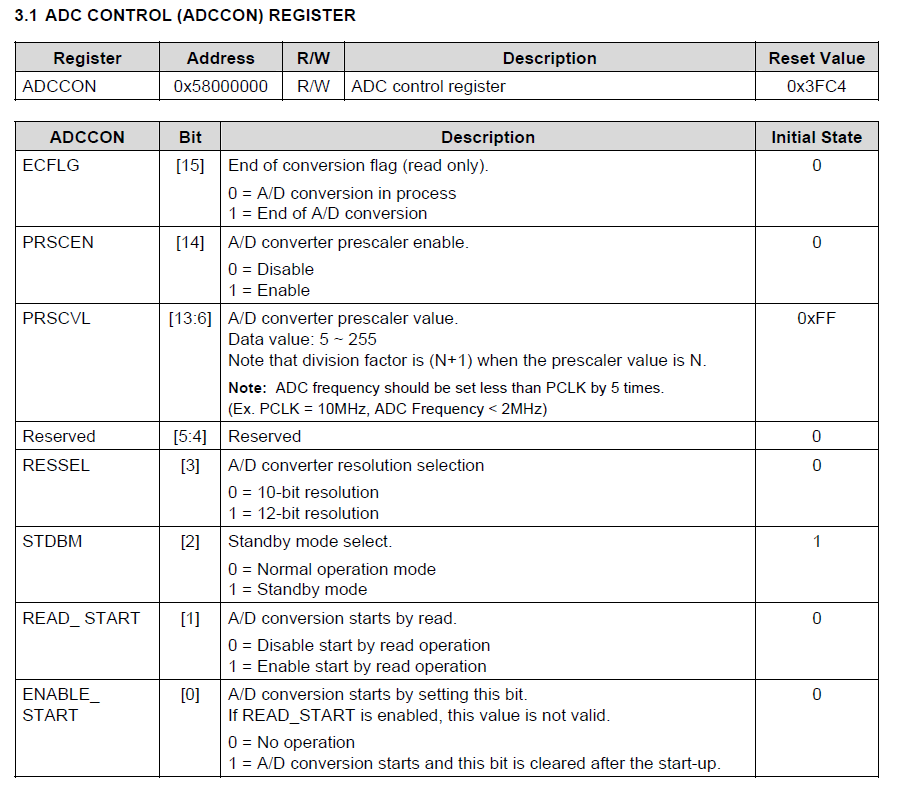
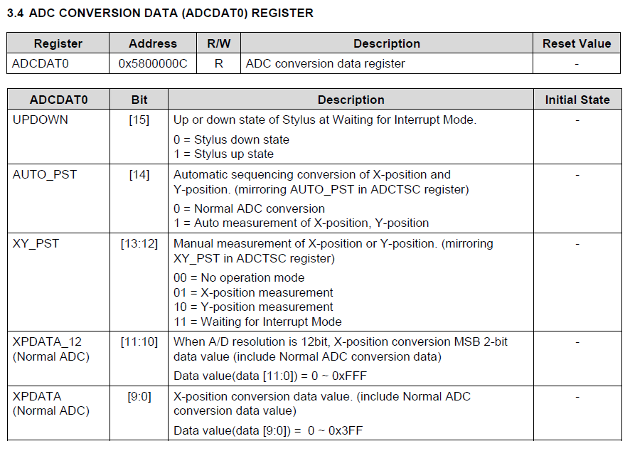
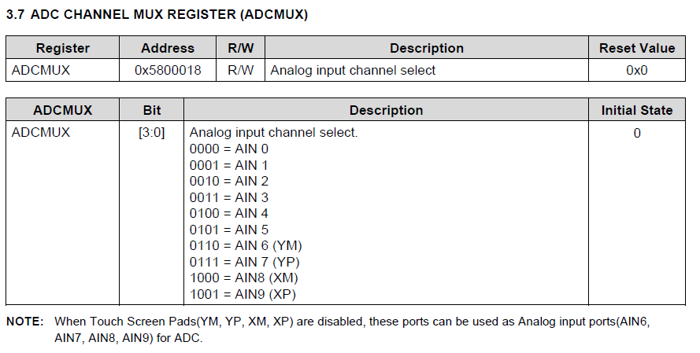

# README

# S3C2450-ADC

간단한 ADC값 읽어오기

## ADC 관련 레지스터

ADC의 전체 레지스터를 소개하지는 않고 사용하는 레지스터만 소개 하도록 하겠다. (전부 하기엔 너무 귀찮아....)

ADCCON 레지스터

ADCCON 레지스터는 ADC를 제어하는 레지스터이다.

[15] : ECFLG : 변환플래그, 0 = A/D 변환중, 1 = A/D 변환 완료

[14] : PSCEN : 프리스케일러 사용 여부, 0 = 사용 안함, 1 = 사용함

[13 : 6] : PRSCVL : 프리스케일러 값 (5 ~ 255)

[5 : 4] : X

[3] : RESSEL : ADC 분해능 선택, 0 = 10비트 분해능, 1 = 12비트 분해능 

※분해능은 얼마나 아날로그에 가깝게 만들 수 있는지를 나타내는 값이므로 클수록 좋다.

[2] : STDBM : 스탠바이 모드 선택, 0 = 일반 동작모드, 1 = 스탠바이 모드

[1] : READ_START : 읽는 동작으로부터 A/D 변환을 시작, 0 = 비활성화, 1 = 활성화

[0] : ENABLE_START : 이 비트를 세팅하면 A/D 변환을 시작, 0 = 비활성화, 1 = 활성화

ADCDAT0 레지스터

ADCDAT0 레지스터는 ADC 값 변환 레지스터이다.

[15] : UPDOWN : Stylus 상태, 0 = DOWN, 1 = UP

[14] : AUTO_PST : 자동 포지션 변환, 0 = 일반 ADC, 1 = 자동 X, Y 포지션 계산

[13 : 12] : XY_PST : 수동 포지션 측정, 00 = 명령 없음, 01 = X 좌표 측정, 10 = Y 좌표 측정, 11 = INT 대기

※ 터치스크린의 터치 부분을 처리하는 부분 또한 ADC로 제어하기 때문에 X, Y 좌표값이 존재한다.

[11 : 10] : XPDATA_12 : 분해능이 12비트일 때의 X좌표와 일반 ADC MSB 2비트 변환 값

[9 : 0] : XPDATA : X좌표와 일반 ADC 변환 값

ADCDAT0의 하위 12비트(12비트 ADC 변환 값)를 가져오기 위해 0x0FFF와 AND 연산한다.

ADCMUX 레지스터

ADCMUX는 ADC 채널 선택 레지스터이다. 이 레지스터에 사용하고 싶은 채널값을 써 넣으면 해당 채널이 활성화된다. 

## ADC 초기화 코드

    #define FREQ 1000000
    
    void ADC_Init(){
        uint8_t Prescaler = (PCLK / FREQ) - 1;
    		rADCCON = (1 << 14) | (Prescaler << 6) | (1 << 3);
        //rADCCON = 0x4C48;
        rADCMUX = 0x0;
        rADCCON |= 0x1;
    }

프리스케일러를 활성화 해서 프리스케일러 값을 ADCCON의 해당 비트값에 쓰고,  12비트 분해능을 선택한다.

ADCMUX의 값을 0x0으로 세팅해서 AIN0을 사용한다.

ADCCON의 [0]의 값을 1로 세팅하여 A/D 변환을 시작한다.

## ADC 값 읽는 코드

    uint16_t ADC_Read(){
        rADCCON = 0x4C49;
        while(!(rADCCON & 0x8000));
        return ((uint16_t)rADCDAT0 & 0xfff);
    }

ADCCON의 [15]의 변환플래그 값이 1이 될때까지 기다린다.

만약, 1이 되면 ADCDAT0의 [11 : 0]의 ADC값을 리턴한다.

## Main 함수

    void Main(){
        Uart_Init(115200);
        ADC_Init();
    
        while(1){
            uint16_t result = ADC_Read();
            
            Uart_Printf("ADC_VAL : %d\r\n", result);
        }
    }

ADC 값을 읽어와서 시리얼 모니터에 뿌려준다.